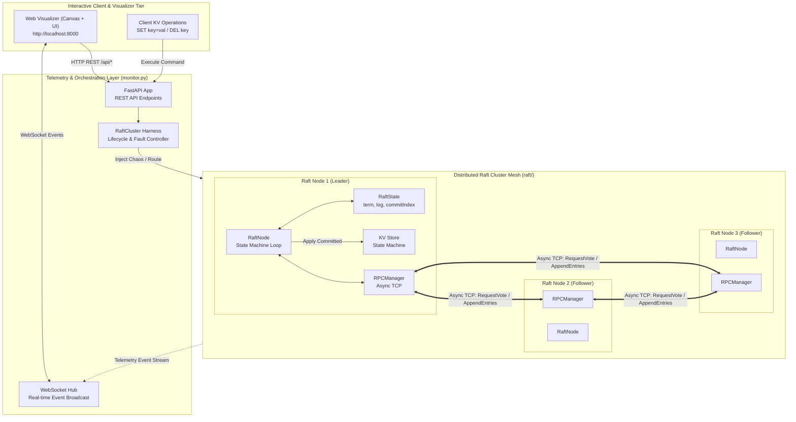
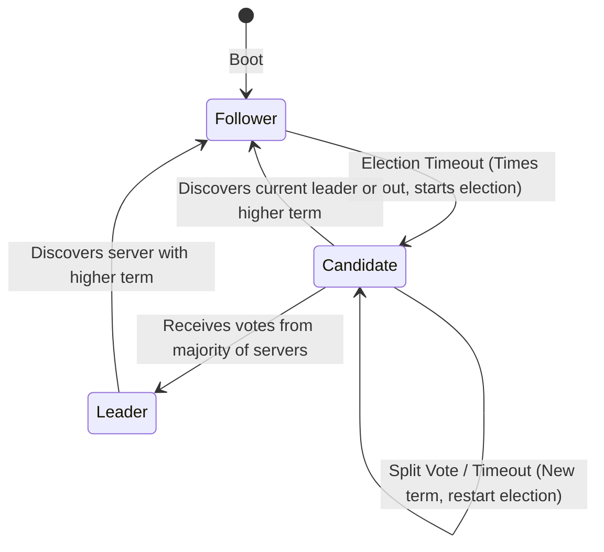

# Distributed Raft Consensus Engine & Real-Time Interactive Visualizer

An explainable, production-grade implementation of the **Raft Distributed Consensus Algorithm** in pure asynchronous Python (`asyncio`), featuring an interactive real-time visualizer dashboard, dynamic node scaling, automated chaos engineering benchmarks, and live cluster failure injection.

Designed with direct 1-to-1 fidelity to Diego Ongaro & John Ousterhout's seminal paper:  
> **[*In Search of an Understandable Consensus Algorithm* (USENIX ATC '14)](https://raft.github.io/raft.pdf)**

---

## 🌟 Key Features

- **Pure Async Python Engine**: Complete Raft implementation using native `asyncio`, asynchronous TCP sockets, and zero heavy external framework dependencies for the consensus core.
- **Strict Raft Paper Fidelity**: Direct implementation of Figure 2 invariants (Randomized election timeouts, strict term precedence, majority quorums, log consistency checks, Section 5.4.2 older-term commit safety rule).
- **Interactive Visualizer ("God Panel")**: Real-time canvas-based network topology, animated RPC packet traffic, live election countdown progress rings, log inspectors, and state machine viewers.
- **Live Chaos & Fault Injection**:
  - **Kill / Revive Nodes**: Dynamically crash nodes and observe election failovers and leader log backfilling.
  - **Network Partitions**: Split the cluster into custom isolated subnets (e.g., $3/2$ split) to visualize split-brain immunity and uncommitted log branches.
  - **Isolate Leader**: Isolate the active leader to witness graceful timeout-based term leadership handoffs.
  - **Drop / Delay Packets**: Simulate high latency and lossy networks on the fly.
- **Dynamic Node Addition**: Dynamically scale the cluster size in pairs (e.g., $5 \rightarrow 7$ nodes) while preserving odd-quorum majority consensus.
- **Comprehensive Chaos Test Suite**: 34 unit, integration, and failure-injection tests covering multi-node cluster failovers, split-brain protection, and log consistency recovery.

---

## 🏛️ System Architecture

The architecture is cleanly structured into three distinct tiers:
1. **Interactive Visualizer & Client Layer**: Canvas-based UI and REST/WebSocket client.
2. **Telemetry & Orchestration Layer**: FastAPI backend managing WebSocket broadcasts and cluster control commands.
3. **Distributed Raft Core**: Independent `RaftNode` instances communicating via an asynchronous TCP RPC mesh.



### Node State Transitions (Section 5.1 / Figure 4)



---

## 📑 Raft Paper Cross-Reference

Every component maps directly to the rules and invariants defined in **Figure 2 (Rules for Servers)** of the Raft paper:

| Paper Section | Topic | Code Implementation | Description |
| :--- | :--- | :--- | :--- |
| **§ 5.1** | **Raft Basics & Roles** | [`raft/state.py`](raft/state.py)<br>[`raft/node.py`](raft/node.py) | `NodeRole` (Follower, Candidate, Leader), 1-based log indexing, strict term precedence ($T > \text{currentTerm}$ reverts to Follower). |
| **§ 5.2** | **Leader Election** | [`raft/node.py`](raft/node.py)<br>[`raft/messages.py`](raft/messages.py) | Randomized election timers (`150ms-300ms`), `RequestVoteArgs/Reply`, single-vote-per-term invariant, majority quorum $(\lfloor N/2 \rfloor + 1)$. |
| **§ 5.2 / 5.3** | **Heartbeats & Replication** | [`raft/node.py`](raft/node.py) | Leader periodic heartbeat broadcasting (30–50ms), client write handling, `AppendEntriesArgs/Reply` exchange, advancing `commitIndex`. |
| **§ 5.4.1** | **Election Restriction** | [`raft/node.py`](raft/node.py) | Reject candidates whose log is less up-to-date (`cand_term > my_term` or `cand_term == my_term and cand_index >= my_index`). |
| **§ 5.4.2** | **Current-Term Commit Rule** | [`raft/node.py`](raft/node.py) | A leader *never* commits entries from older terms by counting replicas directly; only entries from the leader's current term can trigger commit progression. |
| **§ 5.3** | **Log Inconsistency Recovery** | [`raft/node.py`](raft/node.py) | `next_index` backtracking, divergent uncommitted entry truncation, and automatic state machine convergence. |

---

## 🚀 Quickstart

### 1. Requirements & Installation

- Python 3.10+
- Install dependencies:

```powershell
pip install -r requirements.txt
```

### 2. Launch the Interactive Web Visualizer

Start the live cluster monitor server:

```powershell
python monitor.py
```

Open your browser and navigate to:
```
http://localhost:8000
```

From the dashboard, you can:
- **Send Key-Value Writes**: Propose state machine transitions (e.g., `x = 10`, `user = alice`).
- **Simulate Partitions**: Create 3/2 majority-minority splits or isolate the active leader.
- **Inject Chaos**: Kill individual nodes, delay packets, or dynamically add nodes.
- **Inspect Logs**: View uncommitted vs committed log entries side-by-side across all nodes in real time.

---

## 🧪 Automated Testing Suite (`tests/`)

The test harness ([`tests/harness.py`](tests/harness.py)) deterministically executes and validates multi-node cluster scenarios:

```
tests/
├── test_step1_state_machine.py   # 9 tests: State invariants & role transitions
├── test_step2_rpc.py             # 8 tests: TCP wire protocol, framing & fault injection
├── test_step3_election.py        # 5 tests: Quorums, heartbeats & re-elections
├── test_step4_replication.py     # 4 tests: Sequential client writes & KV state commits
├── test_step5_safety.py          # 4 tests: Election safety, backtracking & Section 5.4.2
├── test_step6_chaos.py           # 3 tests: End-to-end chaos scenarios
└── test_step8_monitor.py         # 1 test: Telemetry WebSocket and REST API verification
```

### Run All Tests (34 Tests Passing)

```powershell
python -m pytest tests/ -v
```

### Chaos Scenarios Verified:
1. **Scenario A (Leader Failure)**: Active leader process is terminated; remaining followers elect a new leader and commit new writes without lost data.
2. **Scenario B (3 vs 2 Network Partition)**: 5-node cluster split into majority ($3/5$) and minority ($2/5$). Majority continues writes, minority safely rejects writes, and healing restores full parity.
3. **Scenario C (Crash & Recovery)**: A follower crashes mid-replication, cluster commits 5 writes, follower revives, and leader automatically backfills all missing entries.

---

## 📁 Repository Structure

```
.
├── raft/                  # Pure Python Raft consensus core
│   ├── node.py            # Main RaftNode event loop, election & replication logic
│   ├── state.py           # Persistent & volatile Raft state models
│   ├── messages.py        # Typed dataclasses for RPC args & replies
│   └── rpc.py             # Async TCP wire protocol manager
├── frontend/              # Interactive Visualizer Dashboard
│   ├── index.html         # Real-time UI layout & control panels
│   ├── app.js             # Canvas rendering, WebSocket client & interactive controls
│   └── style.css          # VS Code-inspired dark aesthetic design system
├── tests/                 # Automated testing & chaos validation suite
│   ├── harness.py         # Multi-node in-memory / local network test cluster
│   └── test_step*.py      # Phase 1 to Phase 8 test benchmarks
├── monitor.py             # FastAPI telemetry server & WebSocket hub
├── requirements.txt       # Project dependencies
└── README.md
```

---

## 📜 License

MIT License. Feel free to use and experiment!
