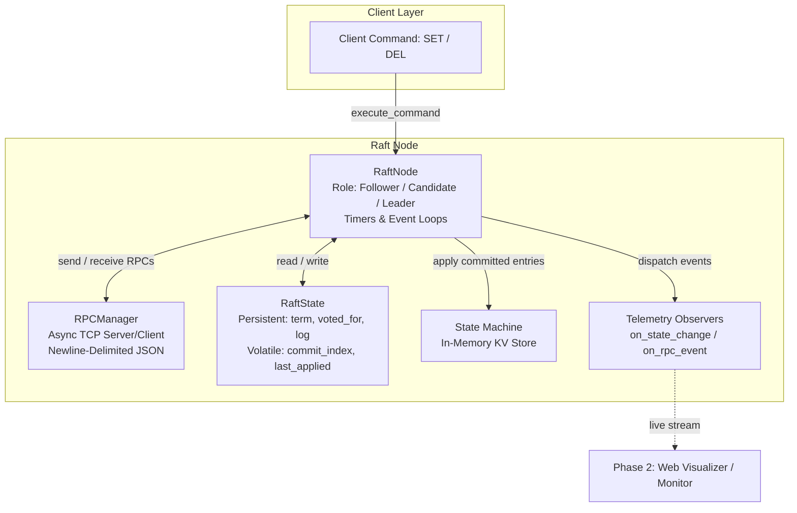
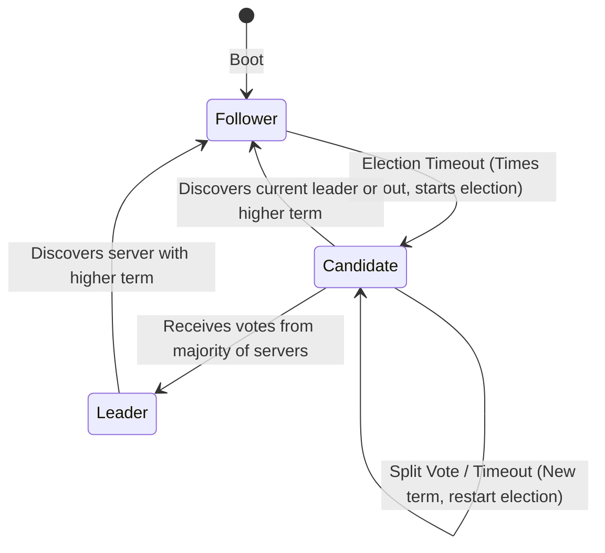

# Distributed Raft Consensus Engine & Chaos Visualizer

An explainable, production-grade implementation of the **Raft Distributed Consensus Algorithm** in pure asynchronous Python (`asyncio`), featuring automated chaos engineering benchmarks and real-time state machine telemetry.

Designed with direct 1-to-1 fidelity to Diego Ongaro & John Ousterhout's seminal paper:  
> **[*In Search of an Understandable Consensus Algorithm* (USENIX ATC '14)](https://raft.github.io/raft.pdf)**

---

## 🏛️ System Architecture

The core engine is decoupled into clear, modular abstractions without heavyweight external framework dependencies:



### Node State Transitions (Section 5.1 / Figure 4)



---

## 📑 Raft Paper Cross-Reference

Every component maps directly to the rules and invariants defined in **Figure 2 (Rules for Servers)** of the Raft paper:

| Paper Section | Topic | Code Implementation | Description |
| :--- | :--- | :--- | :--- |
| **§ 5.1** | **Raft Basics & Roles** | [`raft/state.py`](raft/state.py)<br>[`raft/node.py`](raft/node.py) | `NodeRole` (Follower, Candidate, Leader), 1-based log indexing, strict term precedence ($T > \text{currentTerm}$ reverts to Follower). |
| **§ 5.2** | **Leader Election** | [`raft/node.py`](raft/node.py)<br>[`raft/messages.py`](raft/messages.py) | Randomized election timers (`150ms-300ms`), `RequestVoteArgs/Reply`, single-vote-per-term invariant, majority quorum $(\lfloor N/2 \rfloor + 1)$. |
| **§ 5.2 / 5.3** | **Heartbeats & Replication** | [`raft/node.py`](raft/node.py) | Leader periodic heartbeat broadcasting (30–50ms), client write handling, `AppendEntriesArgs/Reply` exchange, advancing `commitIndex`. |
| **§ 5.4.1** | **Election Restriction** | [`raft/node.py`](raft/node.py) | Reject candidates whose log is less up-to-date (`cand_term > my_term` or `cand_term == my_term and cand_index >= my_index`). |
| **§ 5.4.2** | **Current-Term Commit Rule** | [`raft/node.py`](raft/node.py) | A leader *never* commits entries from older terms by counting replicas directly; only entries from the leader's current term can trigger commit progression. |
| **§ 5.3** | **Log Inconsistency Recovery** | [`raft/node.py`](raft/node.py) | `next_index` backtracking, divergent uncommitted entry truncation, and automatic state machine convergence. |

---

## 🧪 Chaos Testing Suite (`tests/`)

The project includes a multi-node cluster test harness ([`tests/harness.py`](tests/harness.py)) simulating real-world network and process faults:

```
tests/
├── test_step1_state_machine.py   # 9 tests: State invariants & role transitions
├── test_step2_rpc.py             # 8 tests: TCP wire protocol, framing & fault injection
├── test_step3_election.py        # 5 tests: Quorums, heartbeats & re-elections
├── test_step4_replication.py     # 4 tests: Sequential client writes & KV state commits
├── test_step5_safety.py          # 4 tests: Election safety, backtracking & Section 5.4.2
└── test_step6_chaos.py           # 3 tests: End-to-end chaos scenarios
```

### Chaos Scenarios Verified:
1. **Scenario A (Leader Failure)**: Active leader process is terminated; remaining followers elect a new leader and commit new writes without lost data.
2. **Scenario B (3 vs 2 Network Partition)**: 5-node cluster split into majority ($3/5$) and minority ($2/5$). Majority continues writes, minority safely rejects writes, and healing restores full parity.
3. **Scenario C (Crash & Recovery)**: A follower crashes mid-replication, cluster commits 5 writes, follower revives, and leader automatically backfills all missing entries.

---

## 🚀 Quickstart

### 1. Requirements
- Python 3.10+
- `pytest`

### 2. Run All Tests (33 Passing)
```powershell
python -m pytest tests/ -v
```

### 3. Run Specific Chaos Scenarios
```powershell
python -m pytest tests/test_step6_chaos.py -v
```

---

## 🔮 Phase 2 Roadmap: Interactive Web Visualizer

- [x] **Step 1-6**: Core Raft Consensus & Chaos Bench (100% Tested)
- [x] **Step 7**: Core Documentation & Paper Cross-Reference
- [ ] **Step 8**: Telemetry Monitor Server (`monitor.py` - FastAPI + WebSocket + REST God Mode API)
- [ ] **Step 9**: Interactive Frontend Dashboard (`frontend/` - Animated packet travel, live node states, and dynamic partition controls)
